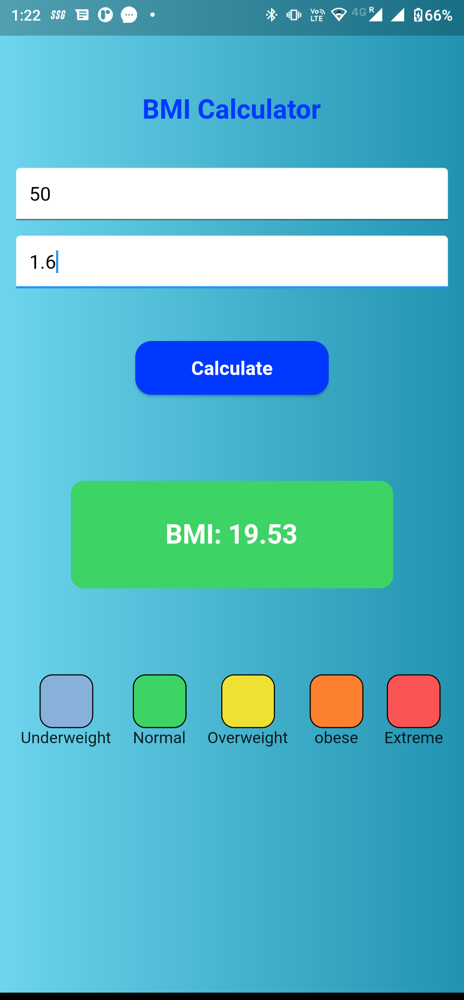
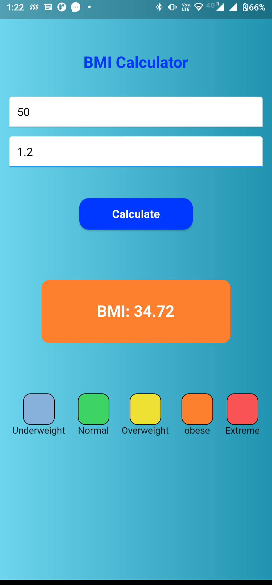
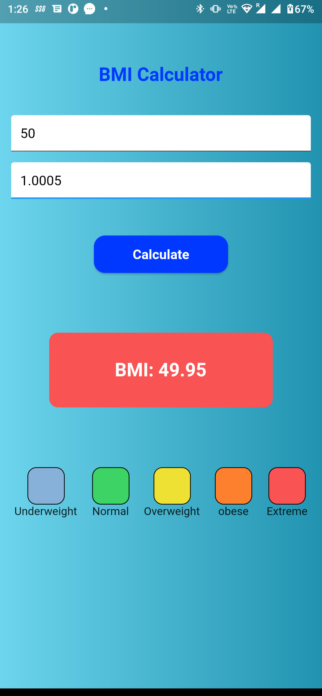

# BMI Calculator : Calculate your BMI

 
<h1 align="start">⚙️ Technology Used</h1>

|||
|:----------------------------------------:|:-----------------------------------------:|
|  </a> <a href="https://www.java.com" target="_blank"> |  </a> <a href="https://www.java.com" target="_blank">  |
  
  
   <h1 align=center> Project Admin  🤵 </h1>

  

  

  

  &nbsp;&nbsp;&nbsp;&nbsp;
  &nbsp;&nbsp;&nbsp;&nbsp;
  &nbsp;&nbsp;&nbsp;&nbsp;

  
   
  
## 📸 Screenshots
 
 

||||
|:----------------------------------------:|:-----------------------------------------:|:-----------------------------------------: |
|  |  |  |
